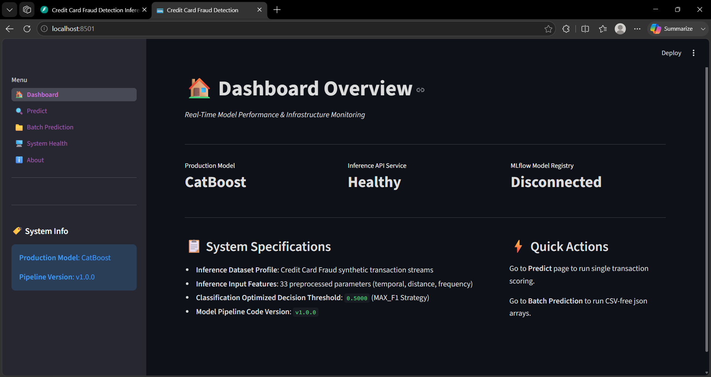
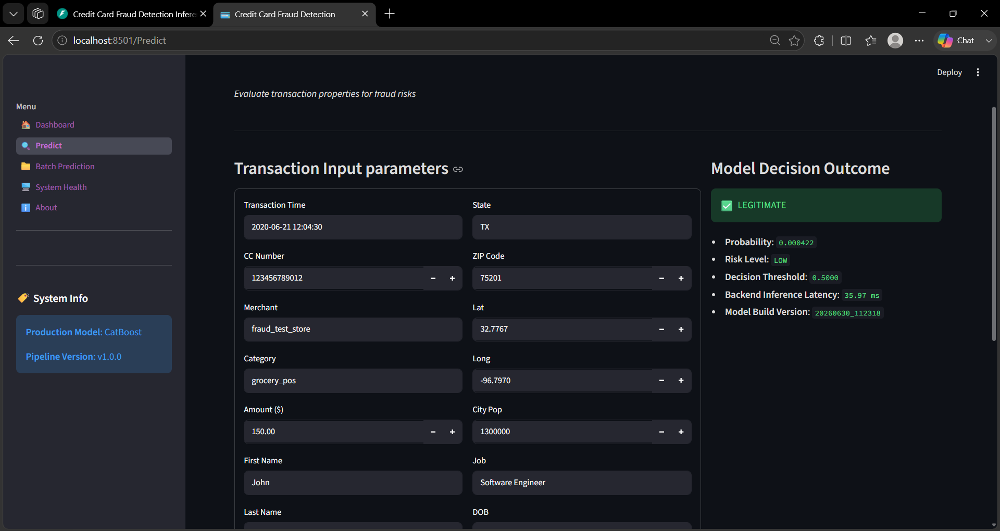
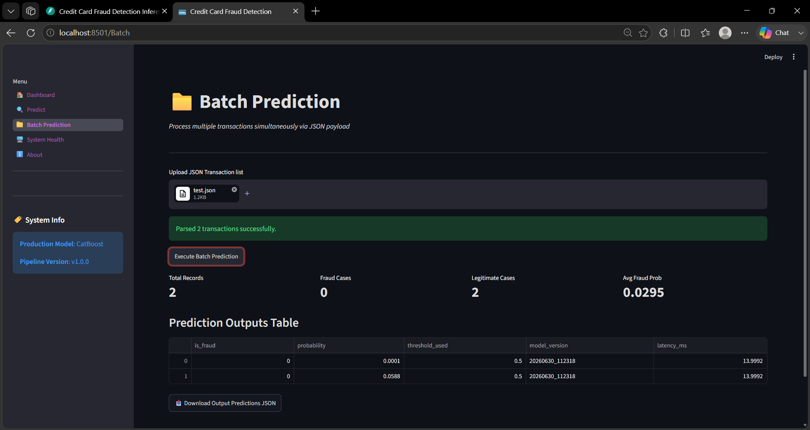
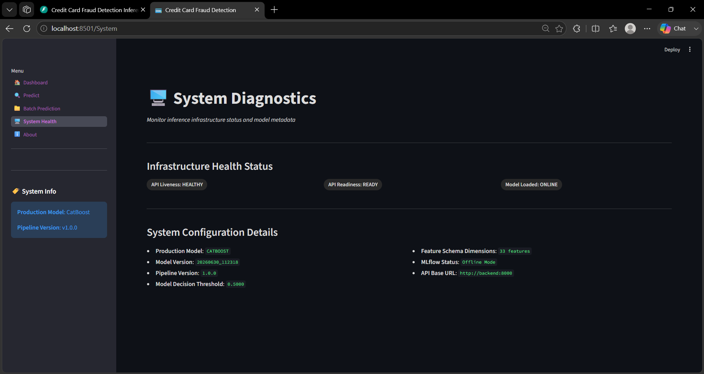
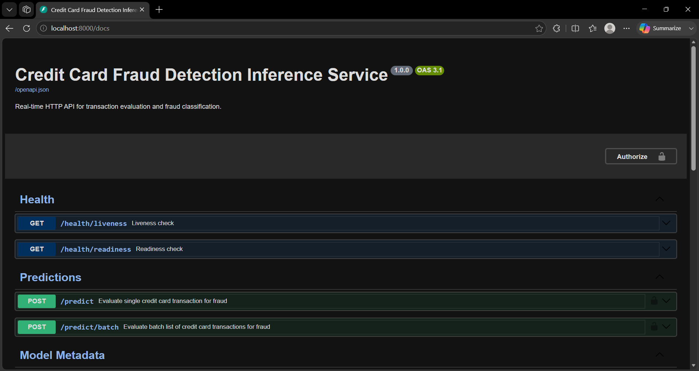

# 💳 Enterprise Credit Card Fraud Detection System

[](https://fastapi.tiangolo.com/)
[](https://streamlit.io/)
[](https://catboost.ai/)
[](https://mlflow.org/)
[](https://www.docker.com/)
[](https://docs.docker.com/compose/)
[](../../actions)
[](https://azure.microsoft.com/)
[](https://nginx.org/)
[](https://letsencrypt.org/)
[](https://letsencrypt.org/)
[](https://www.python.org/)

An enterprise-grade machine learning inference platform for credit card fraud detection. The system validates incoming transactions, performs automated feature engineering and preprocessing, and generates low-latency fraud predictions using a production-ready CatBoost Model. The solution exposes REST APIs through FastAPI Backend, provides an interactive Streamlit Frontend dashboard, supports Docker-based deployment, integrates with MLflow for model management, and includes structured logging, health monitoring, and batch inference capabilities.

---

## 🌐 Live Demo

The production environment is fully deployed and accessible over a secure, encrypted HTTPS connection:

- **Streamlit Frontend (Application Dashboard)**: [https://securepay.kaushik238.me](https://securepay.kaushik238.me)
- **FastAPI Backend (Swagger API Documentation)**: [https://securepay.kaushik238.me/docs](https://securepay.kaushik238.me/docs)

---

## 🔍 Project Overview

### Problem Statement

Credit card fraud remains a major source of financial loss for financial institutions and merchants. Traditional rule-based systems struggle to detect evolving fraud patterns and often generate excessive false positives, increasing operational costs and impacting customer experience.

### Business Objective

Minimize fraud-related financial losses while reducing manual review effort by accurately identifying high-risk transactions. The primary objective is to maximize **Recall** (detect as many fraudulent transactions as possible) while maintaining high **Precision** to reduce false positives.

### Technical Objectives

- **Automated Validation**: Validate incoming transaction data against predefined schemas and quality rules.
- **Inference-Time Feature Engineering**: Generate spatial, temporal, demographic, and frequency-based features dynamically before prediction.
- **Risk Scoring**: Produce fraud probabilities and classification outcomes using configurable decision thresholds.
- **Enterprise Deployment**: Support containerized deployment with Docker, structured logging, health monitoring, and MLflow-based model management.

---

## 📸 Screenshots

*Placeholders for user interface visuals:*

- **Home Dashboard Overview**:
  
- **Single Transaction Predictor**:
  
- **Batch Evaluation & Insights**:
  
- **Infrastructure System Health**:
  
- **Swagger System**:
  

---

## 🚀 Features

- **Robust Data Validation**: Validates incoming transaction data against predefined schemas, data types, categorical constraints, and quality rules.
- **EDA & Insights Pipeline**: Generates feature distributions, temporal analyses, geographic visualizations, correlation heatmaps, and missing-value reports.
- **Dynamic Feature Engineering**: Computes temporal, geographic, demographic, amount-based, and frequency-encoded features during inference.
- **Experiment Tracking**: Logs parameters, metrics, models, and artifacts using MLflow.
- **FastAPI Backend REST API**: Provides low-latency prediction endpoints for single and batch inference.
- **Interactive Streamlit Frontend Dashboard**: Supports single prediction, batch prediction, and system health monitoring.
- **Containerized Deployment**: Multi-stage Docker builds with Docker Compose orchestration for backend and frontend.
- **Centralized Logging**: Structured application logging designed for Docker-native log aggregation.

---

## 🏗️ System Architecture

### Logical Architecture
The system uses a decoupled microservices design running in **MLflow Offline Mode**:

```
Streamlit Frontend ──> FastAPI Backend ──> Local Production Artifacts
```

- **Training Pipeline**: MLflow is fully utilized during the model training phase to log parameters, tracking metrics, plots, and register models.
- **Production Inference**: The FastAPI Backend serving layer bypasses connection attempts to the remote MLflow tracking server and directly loads serialized model and preprocessing assets from `artifacts/models/latest/`. This simplifies infrastructure complexity and eliminates a production dependency on a running MLflow server while preserving full model lineage.

### Deployment Architecture
The production topology incorporates automated container provisioning and secure reverse proxy routing:

```mermaid
graph TD
    subgraph CI/CD Pipeline
        Git[GitHub Repository] -->|Push to main| GHA[GitHub Actions Runner]
        GHA -->|Build & Push Backend/Frontend Images| ACR[Azure Container Registry (ACR)]
        GHA -->|Trigger Recreate via SSH| AzureVM[Azure Virtual Machine (VM)]
    end
    
    User([User / Client]) -->|HTTPS securepay.kaushik238.me| Nginx[Nginx Reverse Proxy]
    Nginx -->|SSL Let's Encrypt SSL| Streamlit[Streamlit Frontend]
    Nginx -->|API Route /docs| FastAPI[FastAPI Backend]
    
    subgraph Docker Compose on Azure VM
        Streamlit -->|HTTP / JSON| FastAPI
        FastAPI -->|Load Local production Artifacts| LocalStore[(artifacts/models/latest/)]
    end
    
    ACR -->|Pull Images| Streamlit
    ACR -->|Pull Images| FastAPI
    
    style Nginx fill:#009639,stroke:#333,stroke-width:2px,color:#fff
    style Streamlit fill:#FF4B4B,stroke:#333,stroke-width:2px,color:#fff
    style FastAPI fill:#009688,stroke:#333,stroke-width:2px,color:#fff
    style ACR fill:#0078d4,stroke:#333,stroke-width:2px,color:#fff
    style AzureVM fill:#0078d4,stroke:#333,stroke-width:2px,color:#fff
```

---

## 🚀 CI/CD Pipeline

The project implements a fully automated GitOps deployment pipeline using **GitHub Actions**. Pushes to the `main` branch trigger the following automated workflow:

```
Developer pushes code to main
      │
      ▼
GitHub Actions workflow automatically triggers
      │
      ▼
Docker Build (runs multi-stage caching for optimized images)
      │
      ▼
Built images pushed to Azure Container Registry (ACR)
      │
      ▼
GitHub Actions runner establishes SSH connection to Azure Virtual Machine (VM)
      │
      ▼
Docker Compose pulls the latest container images from ACR
      │
      ▼
Containers recreated and application updated automatically on Azure VM
      │
      ▼
Nginx Reverse Proxy routes public traffic to containers under HTTPS
      │
      ▼
Production application is active and updated without service disruption
```

---

## 📂 Project Structure

```text
credit-card-fraud-detection/
│
├── artifacts/              # Production model & preprocessing artifacts
├── config/                 # Configuration, settings, logging
├── data/                   # Dataset
├── docs/                   # Project documentation
├── examples/               # Sample prediction payloads
├── frontend/               # Streamlit application
│   ├── pages/
│   └── assets/
├── reports/                # EDA & evaluation reports
├── scripts/                # Utility scripts
├── src/
│   ├── api/                # FastAPI backend
│   ├── validation/         # Data validation
│   ├── features/           # Feature engineering
│   ├── preprocessing/      # Data preprocessing
│   ├── training/           # Model training
│   ├── evaluation/         # Model evaluation
│   ├── mlflow/             # Experiment tracking
│   ├── ingestion/          # Data ingestion
│   └── eda/                # Exploratory Data Analysis
├── github/workflows        #Github workflow
│             |──deploy.yml             
│    
├── Dockerfile.backend
├── Dockerfile.frontend
├── docker-compose.yml
├── docker-compose.azure.yml
├── pyproject.toml
└── README.md
```

---

## ⚙️ Machine Learning Pipeline

  Dataset
   │
  Validation
   │
  EDA
   │
  Feature Engineering
   │
  Preprocessing
   │
  Training
   │
  Evaluation
   │
  MLflow + Artifacts
   │
  FastAPI
   │
  Streamlit

1. **Validation**: Employs the `DatasetValidator` to inspect structural, quality, and target distribution rules. Type matches categories to schemas, checking for structural integrity.
2. **EDA**: Aggregates correlations and statistics to output diagnostic plots stored in `reports/eda/figures/`.
3. **Feature Engineering**: Runs a modular `FeatureEngineeringPipeline` extracting temporal flags (hour, day of week, month, weekend, night), transaction amounts (log scale, high value thresholds), demographics (age, age group), geodistance (customer to merchant distance in km), and running frequency values (historical counts per merchant, category, job, state, city, and gender).
4. **Preprocessing**: Handled by `PreprocessingPipeline` fitting frequency-encoders (for high cardinality categoricals) and one-hot encoders (for low cardinality features), followed by scaling numeric features.
5. **Training**: Supports training multiple machine learning models including CatBoost, XGBoost, LightGBM, and Random Forest. The production inference pipeline uses the CatBoost Model with class imbalance handling.
6. **Evaluation**: Compiles validation and test sets metrics (ROC AUC, PR AUC, F1, Precision, Recall), builds plots (calibration, lift, gain, confusion matrices), and saves features importance configurations.
7. **Deployment**: Production artifacts (model, encoders, scalers, and metadata) are versioned under `artifacts/` and logged to MLflow during training for experiment tracking. In production inference, the backend operates in **MLflow Offline Mode**, loading local production artifacts directly to eliminate the runtime dependency on the MLflow tracking server.
8. **Inference**: The FastAPI Backend service preloads the production model and preprocessing artifacts through a singleton `ModelProvider`. Incoming single and batch prediction requests undergo validation, feature engineering, preprocessing, and model inference before the prediction results are returned.

---

## 🛠️ Technology Stack

| Technology         | Domain           | Description                                                                       |
| :----------------- | :--------------- | :-------------------------------------------------------------------------------- |
| **Python 3.12**    | Language         | Core programming language for the machine learning pipeline and application logic |
| **uv**             | Package Manager  | Fast dependency management and reproducible environment locking                   |
| **FastAPI Backend**| Backend API      | High-performance ASGI framework for serving REST APIs                             |
| **Streamlit Frontend**| Frontend      | Interactive web dashboard for prediction and system monitoring                    |
| **CatBoost Model** | Model Engine     | Production gradient-boosted decision tree model for fraud prediction              |
| **MLflow**         | MLOps            | Experiment tracking, model management, and artifact logging during training       |
| **Pandas / NumPy** | Data Processing  | Data manipulation, numerical computing, and feature engineering                   |
| **Scikit-Learn**   | Machine Learning | Preprocessing, feature transformation, model evaluation, and utility functions    |
| **Docker**         | Containerization | Multi-stage containerized deployment for backend and frontend services            |
| **Docker Compose** | Orchestration    | Container network and lifecycle management                                        |
| **GitHub Actions** | CI/CD            | Automatic building, testing, and continuous deployment                            |
| **Azure VM**       | Cloud Hosting    | Azure Virtual Machine (VM) instance hosting the Dockerized system                 |
| **Azure ACR**      | Container Registry| Azure Container Registry (ACR) storing built container images                     |
| **Nginx**          | Reverse Proxy    | Nginx Reverse Proxy routing, port proxying, and SSL termination                   |
| **Let's Encrypt**  | Security/SSL     | Let's Encrypt SSL certificates providing automated HTTPS traffic support          |

---

## 🛡️ Security & Hardening

The system implements strict security protocols for both data and API access:
- **HTTPS & SSL/TLS Encryption**: Secured using Let's Encrypt SSL certificates (with automatic renewal) via Namecheap Domain DNS configuration.
- **Nginx Reverse Proxy**: Public traffic is routed through Nginx Reverse Proxy acting as a secure gateway, masking internal container port mappings and protecting endpoints.
- **Container Isolation**: Backend and frontend containers run in an isolated private bridge network inside Docker.
- **Non-Root Containers**: Docker images run under non-root users (`app`) to limit potential host-level vulnerabilities.
- **API Key Authentication**: Prediction endpoints `/predict` and `/predict/batch` require a verified `X-API-Key` header token.
- **Environment Variables**: Sensitive configuration parameters (API keys, tracking URIs) are loaded dynamically via secure `.env` files.
- **Health Checks**: Live HTTP status monitoring is run continuously using Python-based inline probes to track container liveness and readiness.

---

## 📥 Installation

### Clone the Repository

```bash
git clone https://github.com/kaushik238P/credit-card-fraud-detection.git
cd credit-card-fraud-detection
```

### Install Dependencies

```bash
uv sync --all-extras
```

### Activate the Environment

**Windows**

```powershell
.venv\Scripts\Activate.ps1
```

**Linux/macOS**

```bash
source .venv/bin/activate
```

---

## 🐳 Docker Deployment

The system is configured with multi-stage Docker builds to keep final runtimes slim, clean, and isolated.

### Local Development
Build and start the application locally:

```bash
docker compose up --build -d
```

Stop the application:

```bash
docker compose down
```

Local Development URLs:
- **Streamlit Frontend**: http://localhost:8501
- **FastAPI Backend API**: http://localhost:8000
- **Swagger UI**: http://localhost:8000/docs

### Production Deployment
The production environment runs on an Azure Virtual Machine (VM). Deployments are managed automatically via the CI/CD pipeline on pushes to the `main` branch. 

Production URLs:
- **Streamlit Frontend**: [https://securepay.kaushik238.me](https://securepay.kaushik238.me)
- **FastAPI Backend (Swagger API)**: [https://securepay.kaushik238.me/docs](https://securepay.kaushik238.me/docs)

---

## 📖 API Documentation

Once the backend is running, interactive API documentation is available locally or in production:
- **Local Development**: http://localhost:8000/docs
- **Production Deployment**: https://securepay.kaushik238.me/docs

Authentication:
Prediction endpoints require an `X-API-Key` header.

### Core Endpoints

| Method | Endpoint | Purpose |
| :---: | :--- | :--- |
| GET | `/health/liveness` | Service health check |
| GET | `/health/readiness` | Model readiness check |
| GET | `/metadata` | Model and pipeline metadata |
| GET | `/version` | Application version information |
| POST | `/predict` | Single transaction prediction |
| POST | `/predict/batch` | Batch transaction prediction |

---

## 🖥️ Frontend Dashboard

The project includes a multi-page **Streamlit Frontend** dashboard for interacting with the fraud detection system.

| Page | Description |
| :--- | :--- |
| 🏠 **Home** | Overview of the application, model information, and system status. |
| 🔍 **Single Prediction** | Predict fraud risk for an individual transaction. |
| 📁 **Batch Prediction** | Upload a JSON file to score multiple transactions simultaneously. |
| 🖥️ **System Health** | Monitor backend health, model readiness, and application status. |
| ℹ️ **About** | Project overview, architecture, and technical information. |

---

## 📈 Model Performance

The production **CatBoost Model** was evaluated using a time-based train/validation/test split with the decision threshold optimized using the **MAX_F1** strategy (`0.404694`).

### Evaluation Summary

| Metric | Validation | Test |
| :---: | :---: | :---: |
| ROC AUC | **0.99683** | **0.99761** |
| PR AUC | **0.90440** | **0.93090** |
| Precision | **0.91888** | **0.92754** |
| Recall | **0.80245** | **0.81765** |
| F1 Score | **0.85673** | **0.86914** |

> Detailed evaluation reports, plots, confusion matrices, calibration curves, ROC curves, PR curves, and feature importance analyses are available in **`reports/evaluation/latest/`**.

---

## 📊 Monitoring & Observability

- **Health Endpoints**: Exposes `/health/liveness` and `/health/readiness` API routes to probe runtime status.
- **Container Health Checks**: Periodic automated container status evaluations configured in Docker Compose.
- **Structured Logging**: Centralized application logging configured for stdout capturing by container log aggregation utilities.
- **MLflow Experiment Tracking**: Model performance metrics, pipeline run statistics, parameter settings, and validation curves are recorded and tracked during training.

---

---

## 👤 Author

**Kaushik Bairwa**

- GitHub: https://github.com/kaushik238P
- LinkedIn: https://www.linkedin.com/in/kaushik-bairwa/
