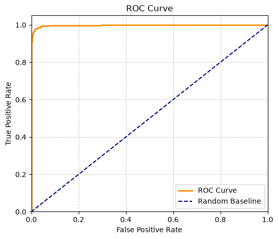
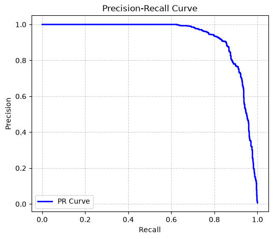
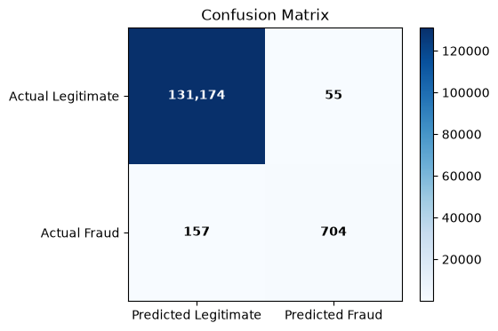
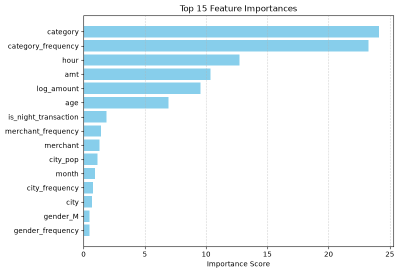
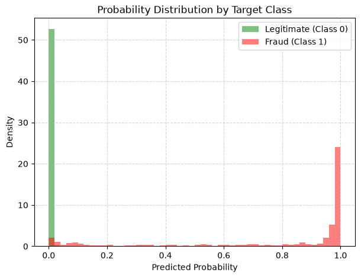
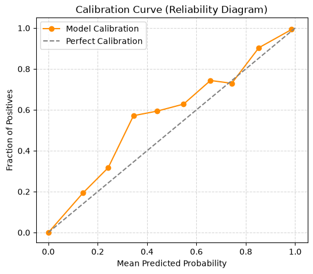
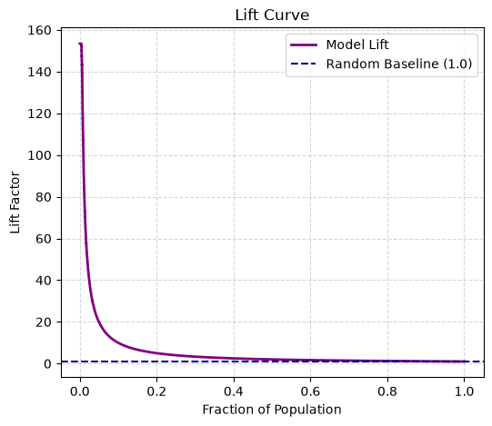
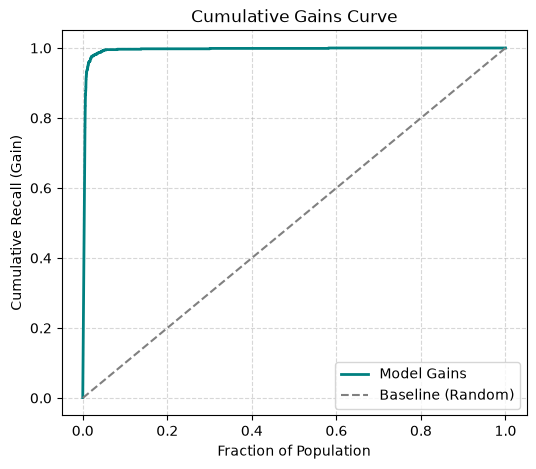

# Model Evaluation Report
**Generated At:** `2026-06-30T11:24:39.260991+00:00`

## 1. System Metadata & Lineage
| Attribute | Value |
|---|---|
| **Model Version (Run ID)** | `20260630_112318` |
| **Preprocessing Version** | `1.0.0` |
| **Dataset SHA-256 Hash** | `4e32829b9ba5a6b17af707c513c15204011044df0e8971e431cedca3d8c0a8a1` |
| **Feature Schema Hash** | `7bfc36a34c781be2cfe9dc0a507dd19732335ae24bef5152d56d566803e37157` |
| **Evaluation Duration** | `7582 ms` |

## 1b. Fold Statistics
Data split summary across training, validation, and testing partitions.

| Fold | Rows | Legitimate | Fraud | Fraud % |
|---|---|---|---|---|
| **Train** | 1,024,843 | 1,018,944 | 5,899 | 0.5756% |
| **Validation** | 138,020 | 137,286 | 734 | 0.5318% |
| **Test** | 132,090 | 131,229 | 861 | 0.6518% |

## 2. Decision Boundary Optimization
- **Strategy applied:** `MAX_F1`
- **Default Threshold:** `0.5`
- **Optimized Decision Threshold:** `0.4047`

### Validation Performance at Optimized Threshold
| Metric | Value |
|---|---|
| Precision | `0.918877` |
| Recall | `0.802452` |
| F1 Score | `0.856727` |

### Decision Boundary Threshold Comparison (Test Set)
Performance comparison between default boundary and optimized decision threshold.

| Metric | Default (0.5) | Optimized |
|---|---|---|
| Precision | `0.938525` | `0.927536` |
| Recall | `0.797909` | `0.817654` |
| F1 Score | `0.862524` | `0.869136` |
| Specificity | `0.999657` | `0.999581` |
| False Positive Rate | `0.000343` | `0.000419` |
| False Negative Rate | `0.202091` | `0.182346` |
| Fraud Detection Rate | `0.797909` | `0.817654` |

> [!NOTE]
> Model probabilities are raw estimator outputs. Threshold optimization operates on uncalibrated probabilities. Probability calibration (Platt Scaling / Isotonic Regression) is future work.

## 3. Core Model Performance
Standard machine learning performance metrics computed across folds.

| Metric | Validation Fold | Test Fold |
|---|---|---|
| Balanced_Accuracy | `0.901037` | `0.908617` |
| Brier_Score | `0.001208` | `0.001304` |
| F1 | `0.856727` | `0.869136` |
| Log_Loss | `0.005319` | `0.005370` |
| MCC | `0.857998` | `0.870079` |
| PR_AUC | `0.904404` | `0.930905` |
| Precision | `0.918877` | `0.927536` |
| ROC_AUC | `0.996830` | `0.997614` |
| Recall | `0.802452` | `0.817654` |
| Sensitivity | `0.802452` | `0.817654` |
| Specificity | `0.999621` | `0.999581` |

## 4. Business & Financial Impact Metrics
Operational metrics to estimate business outcomes on the Test set.

| Business Metric | Score | Rationale |
|---|---|---|
| **Alert_Rate** | `0.005746` | Ratio of flagged transactions to total transactions. |
| **Alerts_per_100_000_Transactions** | `574.608222` | Number of alerts generated per 100,000 transactions. |
| **Alerts_per_10_000_Transactions** | `57.460822` | Number of alerts generated per 10,000 transactions. |
| **Alerts_per_1_000_Transactions** | `5.746082` | Number of alerts generated per 1,000 transactions. |
| **False_Negative_Rate** | `0.182346` | Percentage of fraud transactions missed. |
| **False_Positive_Rate** | `0.000419` | Percentage of legitimate transactions incorrectly flagged. |
| **Fraud_Capture_Rate** | `0.921806` | Percentage of total fraud transaction monetary volume saved. |
| **Fraud_Detection_Rate** | `0.817654` | Percentage of actual fraud cases caught (Recall). |
| **Potential_Fraud_Amount_Detected** | `$430,903.93` | Sum of transaction amounts for correctly detected fraud transactions. Do NOT imply actual monetary savings. |
| **Precision_At_K** | `1.000000` | Precision score evaluating only top 100 predicted scores. |
| **Transactions_Flagged** | `759.000000` | Total number of transactions flagged as fraud by the model. |

### Precision@K Context Details
- **Top K Selected:** `100`
- **Fraud cases inside Top K:** `100`
- **Legitimate cases inside Top K:** `0`
- **Total fraud cases in Test Fold:** `861`

## 5. Model-Native Feature Importance
| Rank | Feature Name | Importance Score |
|---|---|---|
| 1 | `category` | `24.099717` |
| 2 | `category_frequency` | `23.262231` |
| 3 | `hour` | `12.731625` |
| 4 | `amt` | `10.352064` |
| 5 | `log_amount` | `9.549900` |
| 6 | `age` | `6.941338` |
| 7 | `is_night_transaction` | `1.874883` |
| 8 | `merchant_frequency` | `1.419125` |
| 9 | `merchant` | `1.291516` |
| 10 | `city_pop` | `1.141604` |
| 11 | `month` | `0.950682` |
| 12 | `city_frequency` | `0.779865` |
| 13 | `city` | `0.680951` |
| 14 | `gender_M` | `0.482735` |
| 15 | `gender_frequency` | `0.476433` |
| 16 | `job_frequency` | `0.420188` |
| 17 | `gender_F` | `0.412408` |
| 18 | `day_of_week` | `0.407355` |
| 19 | `cc_num` | `0.401684` |
| 20 | `high_value_transaction` | `0.361253` |
| 21 | `lat` | `0.301901` |
| 22 | `age_group` | `0.295004` |
| 23 | `long` | `0.224649` |
| 24 | `job` | `0.218458` |
| 25 | `merch_lat` | `0.214561` |
| 26 | `customer_merchant_distance_km` | `0.183751` |
| 27 | `zip` | `0.182170` |
| 28 | `merch_long` | `0.137764` |
| 29 | `state_frequency` | `0.103877` |
| 30 | `is_weekend` | `0.054211` |
| 31 | `state` | `0.046099` |
| 32 | `business_hours` | `0.000000` |
| 33 | `is_far_transaction` | `0.000000` |

## 6. Diagnostic Visualizations

### ROC Curve

### Precision-Recall Curve

### Confusion Matrix Plot

### Feature Importance Plot

### Probability Distribution

### Calibration Curve

### Lift Curve

### Gain Curve

## 7. Operational Interpretation
Recommended runtime usage constraints and business guidelines:
- **Estimated Alert Volume:** The model will flag approximately `0.57%` of incoming transactions.
- **Observed Fraud Rate:** The historical base rate of fraud observed in the test partition is `0.6518%`.
- **Recommended Review Threshold:** Operational screening queues should apply the optimized decision threshold of `0.4047`.
- **Fraud Screening Suitability:** High precision on top scores makes the model highly suitable for low-latency automated transaction blocking.
- **Continuous Tuning Requirement:** Decision boundaries should be dynamically retuned when operational alert queues undergo scale changes.
